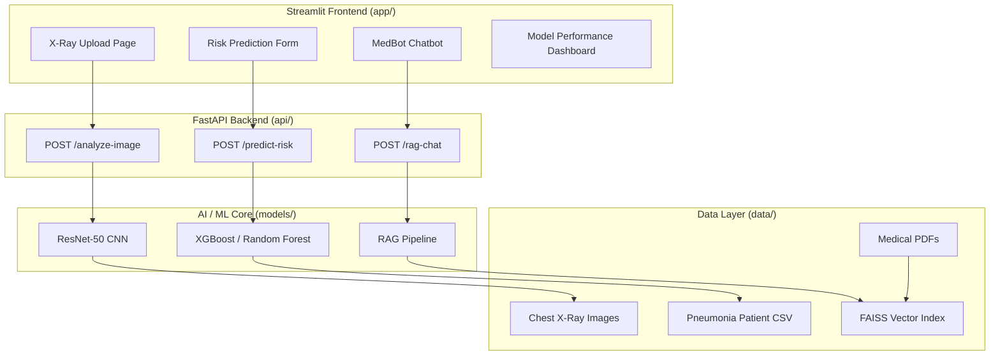
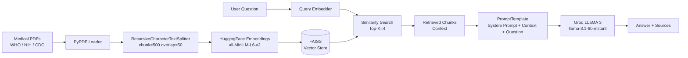

# MedVision AI

A multimodal clinical decision support system for pneumonia detection, severity prediction, and medical Q&A. Built as a final year project using computer vision, machine learning, and retrieval-augmented generation.

---

## Overview

MedVision AI combines three AI modules into a single web application:

- **Module 1 — X-Ray Analysis**: Upload a chest X-ray and get a NORMAL / PNEUMONIA classification using a fine-tuned ResNet-50 CNN.
- **Module 2 — Severity Prediction**: Enter patient vitals and comorbidities to predict Mild vs Severe pneumonia using XGBoost / Random Forest trained on CURB-65 based clinical features.
- **Module 3 — MedBot RAG Chatbot**: Ask pneumonia-related questions. Answers are retrieved from WHO, NIH and CDC medical documents and generated via Groq LLaMA 3.

---

## System Architecture



---

## RAG Pipeline



---

## Project Structure

```
medvision-ai/
├── api/
│   ├── main.py                  # FastAPI entry point
│   └── routes/
│       ├── xray.py              # POST /analyze-image
│       ├── risk.py              # POST /predict-risk
│       └── chat.py              # POST /rag-chat
├── app/
│   ├── main.py                  # Streamlit entry point
│   ├── page0_home.py
│   ├── page1_xray.py
│   ├── page2_risk.py
│   ├── page3_chatbot.py
│   └── page4_eda.py
├── config/
│   ├── rag_config.py            # All RAG settings
│   └── .env                     # API keys (not committed)
├── data/
│   ├── raw/
│   │   ├── chest_xray/          # Kaggle dataset
│   │   └── pneumonia_patients.csv
│   ├── knowledge_base/          # Medical PDFs for RAG
│   └── faiss_index/             # Auto-generated vector store
├── models/
│   ├── rag_pipeline.py          # Ingest, load, query
│   └── weights/                 # Saved model files (auto-generated)
├── notebooks/
│   ├── cnn_core.ipynb           # ResNet-50 training
│   └── ml_pneumonia_full.ipynb  # XGBoost + RF training
├── requirements.txt
└── README.md
```

---

## Setup

### 1. Clone the repository

```bash
git clone https://github.com/your-username/medvision-ai.git
cd medvision-ai
```

### 2. Create a virtual environment

```bash
python -m venv venv
venv\Scripts\activate        # Windows
source venv/bin/activate     # Linux / Mac
```

### 3. Install dependencies

```bash
pip install -r requirements.txt
```

### 4. Configure environment

Create `config/.env`:

```
GROQ_API_KEY=your_groq_api_key_here
```

Get a free Groq API key at: https://console.groq.com

### 5. Download datasets

- **Chest X-Ray**: https://www.kaggle.com/datasets/paultimothymooney/chest-xray-pneumonia  
  Extract to `data/raw/chest_xray/`

- **Pneumonia patient CSV**: already included in `data/raw/pneumonia_patients.csv`

### 6. Download medical PDFs for RAG

Place the following PDFs in `data/knowledge_base/`:

| File | Source |
|---|---|
| 01_who_pneumonia_guidelines.pdf | https://iris.who.int/bitstream/handle/10665/379082/9789240103412-eng.pdf |
| 02_who_childhood_pneumonia.pdf | https://apps.who.int/iris/bitstream/handle/10665/137319/9789241507813_eng.pdf |
| 03_cdc_healthcare_pneumonia.pdf | https://www.cdc.gov/infection-control/media/pdfs/Guideline-Healthcare-Associated-Pneumonia-H.pdf |
| 04_cdc_nosocomial_pneumonia.pdf | https://www.cdc.gov/mmwr/pdf/rr/rr4601.pdf |
| 05_cdc_mycoplasma_pneumonia.pdf | https://www.cdc.gov/mycoplasma/media/pdfs/mycoplasma-fact-sheet.pdf |
| 06_cap_clinical_guidelines.pdf | https://www.medstarfamilychoice.com/-/media/project/mho/mfc/community-acquired-pneumonia-adults--final-oct-2023.pdf |

---

## Running the Project

Run all steps in order:

### Step 1 — Train the CNN model

Open and run all cells in `notebooks/cnn_core.ipynb`.  
Saves `resnet50_pneumonia.pkl`, `model_meta.pkl` and training charts to `models/weights/`.

### Step 2 — Train the ML model

Open and run all cells in `notebooks/ml_pneumonia_full.ipynb`.  
Saves `pneumonia_risk_model.pkl`, `pneumonia_scaler.pkl`, `pneumonia_meta.pkl` and evaluation charts to `models/weights/`.

### Step 3 — Ingest documents for RAG

```bash
python models/rag_pipeline.py --ingest
```

Saves FAISS index to `data/faiss_index/`. Run once only.

### Step 4 — Start FastAPI backend

```bash
uvicorn api.main:app --reload --port 8000
```

API docs available at: http://localhost:8000/docs

### Step 5 — Start Streamlit frontend (Optional/Legacy)

```bash
cd app
streamlit run main.py
```

App available at: http://localhost:8501

### Step 6 — Start React.js frontend (New SPA)

```bash
cd frontend
npm install
npm run dev
```

App available at: http://localhost:3000

---

## Models

| Module | Model | Dataset | Task |
|---|---|---|---|
| X-Ray Analysis | ResNet-50 (fine-tuned) | Kaggle Chest X-Ray (5,863 images) | NORMAL vs PNEUMONIA |
| Severity Prediction | XGBoost / Random Forest | Synthetic CURB-65 (2,000 patients) | Mild vs Severe |
| RAG Chatbot | LLaMA 3 via Groq | WHO / NIH / CDC PDFs | Medical Q&A |

---

## API Endpoints

| Method | Endpoint | Description |
|---|---|---|
| POST | /api/analyze-image | Upload chest X-ray, returns label + confidence |
| POST | /api/predict-risk | Submit patient data, returns severity + probability |
| POST | /api/rag-chat | Ask a question, returns answer + source documents |
| GET | /health | Health check |

---

## Tech Stack

| Layer | Technology |
|---|---|
| Frontend | React.js (Vite, React Router v6, Recharts, Lucide-React) / Streamlit |
| Backend | FastAPI |
| CNN Model | PyTorch, ResNet-50 |
| ML Models | XGBoost, Random Forest, scikit-learn |
| RAG | LangChain, FAISS, sentence-transformers |
| LLM | Groq (LLaMA 3 — llama-3.1-8b-instant) |
| Embeddings | sentence-transformers/all-MiniLM-L6-v2 |

---

## Reference

Lim, W. S., et al. (2003). Defining community acquired pneumonia severity on presentation to hospital: an international derivation and validation study. *Thorax*, 58(5), 377–382.
